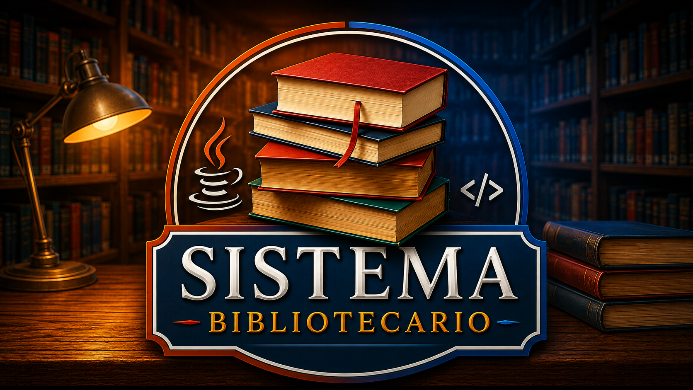

# 📚 Sistema Bibliotecario

<p align="center">

</p>

<p align="center">
  
</p>

<p align="center">
    
  
  
  
</p>

<p align="center">
<strong>Java · Swing · NetBeans · Apache Ant</strong>
</p>


## 📖 Descripción

Proyecto final desarrollado originalmente en **noviembre de 2016** para la materia **Programación 1 (SOF-003)** en el **Instituto Tecnológico de las Américas (ITLA)**.

La aplicación fue construida utilizando **Java Swing** sobre **NetBeans** y simula las operaciones básicas de una biblioteca, permitiendo registrar usuarios, iniciar sesión, prestar libros, comprar libros y generar comprobantes.

En **junio de 2026** el proyecto fue restaurado, corregido y actualizado para preservar su funcionamiento en versiones modernas de Java, manteniendo su esencia académica original.

---

# 📌 Información del proyecto

- 📘 **Materia:** Programación 1 (SOF-003)
- 👨‍🏫 **Profesor:** Keneth John Aponte Alonzo
- 🏫 **Institución:** Instituto Tecnológico de las Américas (ITLA)
- 📅 **Período Académico:** 2016-C3
- 🛠️ **Restauración y mantenimiento:** Junio 2026

---

# 👥 Integrantes

| Integrante | Matrícula |
|------------|-----------|
| 👤 Reydi Isaac Charles Frias | **2015-2965** |
| 👤 Francis Jairo Matías Rosario | **2015-2984** |
| 👤 Eduandy Isabel Cruz Abreu | **2015-3017** |
| 👤 Orlando Antonio Dominici Vanterpool | **2015-3029** |
| 👤 Freddy Nicolas Mejia Peña | **2015-3038** |

---

# ✨ Funcionalidades

- 🔐 Inicio de sesión.
- 👤 Registro de usuarios.
- 📚 Consulta del catálogo de libros.
- 📖 Préstamo de libros.
- 🛒 Compra de libros.
- 📑 Generación de recibos de préstamo.
- 🧾 Generación de facturas de compra.
- 🏫 Integración del logo institucional del ITLA.
- ⌨️ Navegación mediante la tecla **ENTER**.
- 🚪 Cierre de sesión.
- 🎨 Restauración de la interfaz gráfica original.

---

# 🔐 Usuario de prueba

```text
Usuario: admin
Contraseña: 1234
```

---

# 🛠️ Restauración realizada en 2026

Durante el mantenimiento del proyecto se realizaron las siguientes mejoras:

- ✅ Corrección del flujo de navegación entre ventanas.
- ✅ Implementación de validación del inicio de sesión.
- ✅ Corrección de botones sin funcionalidad.
- ✅ Incorporación del botón **Cerrar sesión**.
- ✅ Restauración completa de la ventana **Acerca de**.
- ✅ Restauración de fondos originales.
- ✅ Paneles semitransparentes para mejorar la legibilidad.
- ✅ Integración del logo del ITLA en facturas y recibos.
- ✅ Facturas dinámicas.
- ✅ Recibos dinámicos.
- ✅ Compatibilidad con versiones actuales de Java.
- ✅ Limpieza general del proyecto.
- ✅ Actualización de documentación.
- ✅ Configuración de `.gitignore`.
- ✅ Publicación del proyecto en GitHub.

---

# 🧰 Tecnologías utilizadas

<p align="center">

</p>

- ☕ Java
- 🖥️ Java Swing
- 🧩 Apache NetBeans IDE
- 🐜 Apache Ant
- 🌿 Git
- 🐙 GitHub

---

# ▶️ Ejecución

Abrir el proyecto desde **Apache NetBeans** y ejecutar:

```text
Clean and Build
Run Project
```

También puede ejecutarse el archivo `.jar` generado dentro de la carpeta `dist` una vez compilado.

---

# 📂 Estructura del proyecto

```text
src/
├── imagenes/
│   ├── fondito.png
│   ├── itla.png
│   ├── userrrrrr.png
│   └── ...
│
└── ventanas/
    ├── interfaz.java
    ├── Registro.java
    ├── Decision.java
    ├── Comprarlibros.java
    ├── prestamos.java
    └── facturas.java
```

---

# 📜 Licencia

Este proyecto fue desarrollado originalmente con fines **académicos** para el ITLA.

La restauración realizada en **2026** tiene como finalidad preservar el proyecto como parte del portafolio personal del autor, respetando la autoría y el contexto académico del trabajo original.

---

# 🙌 Agradecimientos

- 🏫 Instituto Tecnológico de las Américas (ITLA)
- 👨‍🏫 Prof. Keneth John Aponte Alonzo
- 👥 Equipo de desarrollo original (2016)

---

> **Proyecto original (2016) restaurado y mantenido en 2026 para conservar su funcionamiento, documentación y valor histórico como parte de un portafolio de desarrollo de software.**
