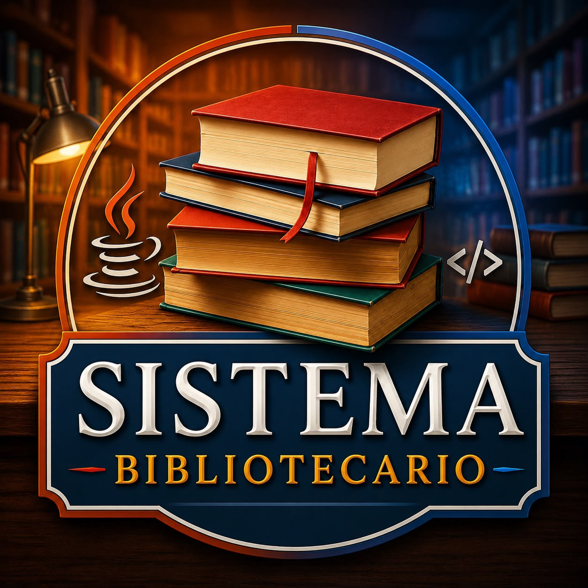
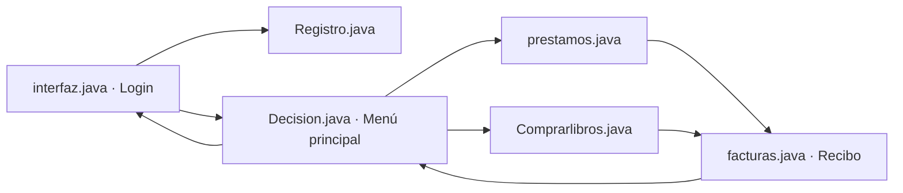

<div align="center">

<p align="center">
  
</p>

<p align="center">
  
</p>

Aplicación de escritorio desarrollada en Java Swing para gestionar usuarios, préstamos, compras de libros, facturas y recibos dentro de un entorno bibliotecario académico.

[](https://www.java.com/)
[](https://netbeans.apache.org/)
[](https://ant.apache.org/)

> Estado actual: **Proyecto restaurado, funcional, documentado y preparado para portafolio profesional.**

</div>

---

## 📌 Descripción

**Sistema Bibliotecario** es una aplicación de escritorio creada originalmente como proyecto final de la asignatura **Programación 1 (SOF-003)** del **Instituto Tecnológico de las Américas (ITLA)** durante el período **2016-C3**.

El sistema fue desarrollado con **Java Swing** en **Apache NetBeans** y permite simular procesos básicos de una biblioteca, incluyendo registro de usuarios, inicio de sesión, consulta de libros, préstamos, compras y generación de comprobantes.

En **junio de 2026**, el proyecto fue restaurado, corregido y documentado para preservar su funcionamiento en versiones modernas de Java, manteniendo intacta su identidad académica y visual original.

---

## ✨ Funcionalidades disponibles

- Inicio de sesión con validación básica de credenciales.
- Registro de usuarios.
- Menú principal con navegación a préstamos y compras.
- Consulta del catálogo de libros.
- Selección individual de libros.
- Selección de todos los libros disponibles.
- Cálculo automático del total de compra.
- Generación dinámica de facturas.
- Generación dinámica de recibos de préstamo.
- Integración del logo institucional del ITLA en comprobantes.
- Navegación mediante la tecla **ENTER**.
- Cierre de sesión.
- Ventana **Acerca de** con información académica del proyecto.
- Interfaz restaurada conservando el fondo, la tipografía y el concepto visual original.

---

## 🎓 Información académica original

| Dato | Información |
|---|---|
| Institución | Instituto Tecnológico de las Américas (ITLA) |
| Asignatura | Programación 1 |
| Código | SOF-003 |
| Profesor | Keneth John Aponte Alonzo |
| Período académico | 2016-C3 |
| Modalidad | Proyecto Final Grupal |

### 👥 Integrantes del proyecto original

| Integrante | Matrícula |
|---|---|
| Reydi Isaac Charles Frias | 2015-2965 |
| Francis Jairo Matías Rosario | 2015-2984 |
| Eduandy Isabel Cruz Abreu | 2015-3017 |
| Orlando Antonio Dominici Vanterpool | 2015-3029 |
| Freddy Nicolas Mejia Peña | 2015-3038 |

---

## 📖 Historia del proyecto

El sistema nació como un proyecto académico enfocado en aplicar conceptos fundamentales de **programación orientada a objetos**, formularios, manejo de eventos y navegación entre ventanas.

La versión original fue construida con Java Swing y Apache NetBeans, utilizando una interfaz gráfica representativa de su época. Diez años después, el código fue recuperado para corregir funcionalidades incompletas, mejorar la estabilidad y documentar el proyecto sin convertirlo en una aplicación diferente.

La versión actual conserva elementos esenciales del desarrollo original, como el fondo de libros, la tipografía de las interfaces y la estructura general de navegación.

---

## 🎯 Objetivo de la restauración

Preservar uno de los primeros proyectos académicos del autor y demostrar su evolución mediante:

- Corrección de flujos de navegación.
- Validación básica de acceso.
- Restauración de funcionalidades incompletas.
- Generación dinámica de facturas y recibos.
- Mejora visual manteniendo el concepto original.
- Limpieza y organización del repositorio.
- Documentación técnica y académica para GitHub.

---

# 🧱 Stack tecnológico

## ⚙️ Lenguaje y lógica de aplicación

<div align="center">


</div>

| Área | Tecnología |
|---|---|
| Lenguaje principal | Java |
| Paradigma | Programación orientada a objetos |
| Lógica funcional | Validaciones, navegación, compras, préstamos y comprobantes |
| Modelo de interacción | Programación orientada a eventos |

## 🖥️ Interfaz de escritorio

<div align="center">


</div>

| Área | Tecnología |
|---|---|
| Toolkit gráfico | Java Swing |
| Componentes | JFrame, JPanel, JLabel, JButton, JTextField, JTextPane y JScrollPane |
| Diseño | AbsoluteLayout de NetBeans |
| Recursos visuales | Imágenes PNG/JPEG empaquetadas en el proyecto |

## 🧰 Entorno de desarrollo y compilación

<div align="center">


</div>

| Área | Tecnología |
|---|---|
| IDE | Apache NetBeans |
| Sistema de compilación | Apache Ant |
| Proyecto | Estructura estándar de NetBeans |
| Artefacto generado | Archivo ejecutable `.jar` |

## 🛠️ Control de versiones

<div align="center">


</div>

| Área | Tecnología |
|---|---|
| Control de versiones | Git |
| Repositorio | GitHub |
| Documentación | Markdown |
| Preservación | Historial de cambios y restauración del código legado |

---

## 🏗️ Arquitectura y flujo de navegación

El proyecto utiliza una arquitectura simple basada en ventanas Swing, apropiada para su contexto académico original.



Flujo principal:

```text
Login → Menú principal → Préstamos / Compras → Factura o recibo
```

---

## 🧩 Responsabilidad de las clases principales

| Clase | Responsabilidad |
|---|---|
| `interfaz.java` | Inicio de sesión y ventana Acerca de |
| `Registro.java` | Formulario de registro de usuarios |
| `Decision.java` | Menú principal y cierre de sesión |
| `Comprarlibros.java` | Selección, cálculo y compra de libros |
| `prestamos.java` | Selección y préstamo de libros |
| `facturas.java` | Presentación de facturas y recibos |

---

## 🔐 Usuario de prueba

| Campo | Valor |
|---|---|
| Usuario | `admin` |
| Contraseña | `1234` |

> Estas credenciales son exclusivamente para ejecutar y probar el proyecto académico de forma local.

---

## ✅ Requisitos previos

Antes de ejecutar el proyecto debes tener instalado:

- JDK 8 o una versión moderna de Java compatible.
- Apache NetBeans.
- Apache Ant, normalmente incluido con NetBeans.
- Git, solo si deseas clonar el repositorio.

Verifica Java:

```bash
java -version
javac -version
```

---

## 📥 Clonar el repositorio

```bash
git clone https://github.com/Jairo0811/SistemaBibliotecario.git
cd SistemaBibliotecario
```

---

## ▶️ Ejecutar el proyecto

### Opción 1: Apache NetBeans

1. Abre Apache NetBeans.
2. Selecciona **File → Open Project**.
3. Abre la carpeta `interfaces`.
4. Ejecuta **Clean and Build**.
5. Ejecuta **Run Project**.

### Opción 2: Apache Ant

Desde la raíz del repositorio:

```bash
ant -f interfaces clean jar
```

El archivo generado estará disponible en:

```text
interfaces/dist/
```

### Opción 3: Ejecutar el JAR

Después de compilar:

```bash
java -jar interfaces/dist/ProyectoFinal.jar
```

> El nombre exacto del archivo `.jar` depende de la configuración conservada en `nbproject/project.properties`.

---

## 📂 Estructura principal

```text
SistemaBibliotecario/
├── docs/
│   └── logo.jpeg
├── interfaces/
│   ├── src/
│   │   ├── imagenes/
│   │   │   ├── fondito.png
│   │   │   ├── itla.png
│   │   │   ├── userrrrrr.png
│   │   │   └── ...
│   │   └── ventanas/
│   │       ├── interfaz.java
│   │       ├── Registro.java
│   │       ├── Decision.java
│   │       ├── Comprarlibros.java
│   │       ├── prestamos.java
│   │       └── facturas.java
│   ├── build.xml
│   └── nbproject/
├── README.md
└── .gitignore
```

---

## 🛠️ Restauración realizada en 2026

Durante el proceso de mantenimiento se realizaron las siguientes mejoras:

- Corrección del flujo de navegación entre ventanas.
- Implementación de validación básica del inicio de sesión.
- Corrección de botones sin funcionalidad.
- Incorporación del botón **Cerrar sesión**.
- Restauración de la ventana **Acerca de**.
- Restauración de fondos originales.
- Incorporación de paneles semitransparentes.
- Integración del logo del ITLA en facturas y recibos.
- Conversión de facturas y recibos estáticos en comprobantes dinámicos.
- Compatibilidad con versiones modernas de Java.
- Limpieza de archivos generados.
- Configuración de `.gitignore`.
- Actualización completa de la documentación.

---

## 📈 Evolución del proyecto

| Característica | Versión original (2016) | Restauración (2026) |
|---|:---:|:---:|
| Java Swing | ✅ | ✅ |
| Inicio de sesión | ⚠️ Básico | ✅ Validado |
| Registro de usuarios | ✅ | ✅ |
| Compra de libros | ⚠️ Incompleta | ✅ Funcional |
| Préstamo de libros | ⚠️ Incompleto | ✅ Funcional |
| Facturas y recibos | ⚠️ Estáticos | ✅ Dinámicos |
| Logo del ITLA | ❌ | ✅ |
| Cierre de sesión | ❌ | ✅ |
| Navegación con ENTER | ❌ | ✅ |
| Documentación profesional | ❌ | ✅ |

---

## 🚦 Estado del proyecto

- [x] Restauración del código original.
- [x] Corrección de navegación.
- [x] Validación de inicio de sesión.
- [x] Registro de usuarios.
- [x] Compra de libros.
- [x] Préstamo de libros.
- [x] Facturas dinámicas.
- [x] Recibos dinámicos.
- [x] Ventana Acerca de.
- [x] Identidad visual del proyecto.
- [x] Documentación profesional.
- [x] Publicación en GitHub.

---

## 📅 Línea de tiempo

| Fecha | Evento |
|---|---|
| 🎓 **2016-C3** | Desarrollo del proyecto académico original. |
| 🛠️ **Junio 2026** | Restauración, mantenimiento, mejoras visuales y documentación. |

---

## 📸 Capturas de pantalla

Las capturas pueden organizarse en una carpeta como:

```text
docs/screenshots/
├── login.png
├── registro.png
├── menu-principal.png
├── prestamos.png
├── compras.png
├── factura.png
├── recibo.png
└── acerca-de.png
```

---

## 🏆 Aprendizajes

Este proyecto permite demostrar conocimientos de:

- Java.
- Java Swing.
- Programación orientada a objetos.
- Programación orientada a eventos.
- Diseño y navegación entre interfaces gráficas.
- Manejo de recursos visuales.
- Validaciones básicas.
- Generación de comprobantes.
- Apache NetBeans.
- Apache Ant.
- Git y GitHub.
- Mantenimiento de software legado.

---

## 🤝 Créditos académicos

La idea y el desarrollo original corresponden al proyecto final elaborado en equipo para la asignatura **Programación 1 (SOF-003)** del **Instituto Tecnológico de las Américas (ITLA)** durante el período **2016-C3**.

---

## 👨‍💻 Autor de la restauración

**Francis Jairo Matías Rosario**

Restauración del código legado, corrección de funcionalidades, actualización visual, documentación y preparación del repositorio para portafolio profesional.

---

## 📜 Licencia y contexto académico

Este proyecto fue desarrollado originalmente con fines académicos para el ITLA.

La restauración realizada en 2026 tiene como finalidad preservar el proyecto como parte del portafolio personal del autor, respetando la autoría y el contexto académico del trabajo original.

---

<p align="center">
  <strong>📚 De un proyecto académico desarrollado durante el período 2016-C3 a una aplicación restaurada, funcional y documentada profesionalmente en 2026.</strong>
</p>
