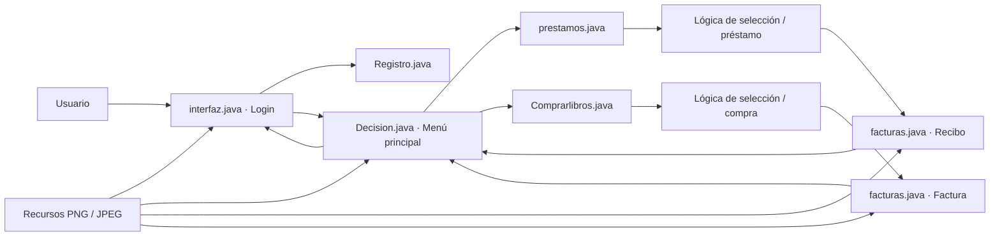
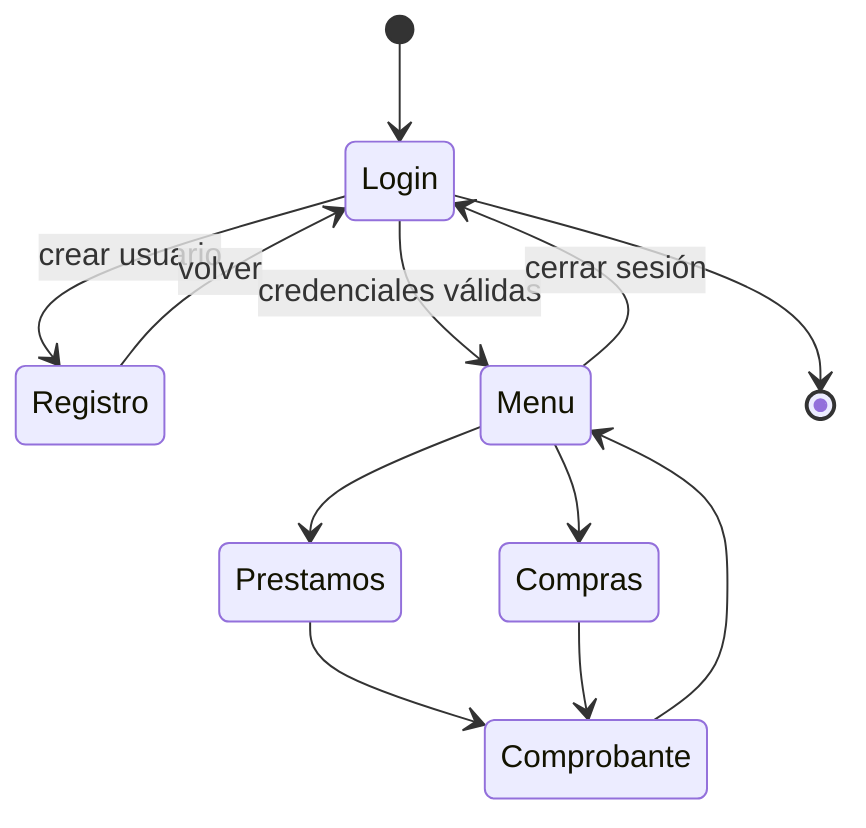
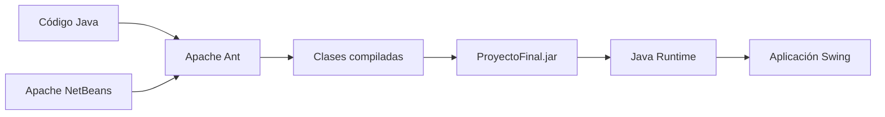

# Arquitectura de Sistema Bibliotecario

Sistema Bibliotecario conserva deliberadamente una arquitectura de escritorio **Java Swing orientada a eventos**, coherente con su origen académico de 2016. La restauración de 2026 estabiliza el flujo sin convertir el proyecto legado en una aplicación de capas moderna que no existía originalmente.

## Vista general



No existe una capa de persistencia empresarial ni una API externa: el valor del proyecto está en preservar el modelo de programación orientada a objetos, eventos y navegación entre formularios que correspondía al alcance de Programación 1.

## Flujo de navegación



## Responsabilidades principales

| Componente | Responsabilidad |
|---|---|
| `interfaz.java` | Inicio de sesión, entrada al sistema y ventana Acerca de |
| `Registro.java` | Captura de datos para registro de usuarios |
| `Decision.java` | Menú principal, navegación y cierre de sesión |
| `prestamos.java` | Selección de libros y flujo de préstamo |
| `Comprarlibros.java` | Selección de libros, cálculo y flujo de compra |
| `facturas.java` | Presentación dinámica de factura o recibo |
| `imagenes/` | Recursos visuales utilizados por las ventanas Swing |

## Arquitectura física

```text
SistemaBibliotecario/
├── docs/
├── interfaces/
│   ├── src/
│   │   ├── imagenes/
│   │   └── ventanas/
│   ├── build.xml
│   └── nbproject/
└── README.md
```

## Build y ejecución



## Decisiones de preservación

- Se mantiene Java Swing y la navegación basada en ventanas.
- No se introduce artificialmente MVC, repositorios o una base de datos que el proyecto original no necesitaba.
- Las correcciones se concentran en estabilidad, navegación, comprobantes y compatibilidad.
- La arquitectura documentada describe el sistema real restaurado, no una reescritura hipotética.
